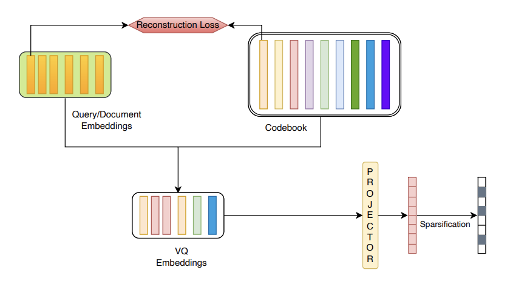

# LSR-VQ



Learned Sparse Retrieval with Vector Quantization

- Dataset: [MSMARCO](https://microsoft.github.io/msmarco/Datasets#passage-ranking-dataset) passage ranking dataset in full ranking setting.
- Access the notebook [here](https://drive.google.com/file/d/1RvjHSrAmyanZXX7AxIVl3dBfQPcDr4-p/view?usp=sharing)
- Access the entire folder setup [here](https://drive.google.com/drive/u/3/folders/1hFx3EKA1jqvvYu-qRvFgn19ju87jDkk4)
- Currently data is hosted on [Google Drive](https://drive.google.com/drive/folders/1LZxxAqjZJ8gpcAgM9XYGZ56MiydTQzsm?usp=drive_link)

- conda env create -f environment.yml


# Learned Sparse Retrieval with Vector Quantization

This repository contains code for performing sparse retrieval using vector quantization techniques. It leverages transformer-based embeddings, quantizes them into sparse codes, and evaluates retrieval performance on datasets using metrics like MRR, NDCG, and Recall.

## Structure

- **EmbeddingProcessor class**: Handles generation and storage of query and passage embeddings.
- **Dependencies**: Transformers, Torch, FAISS, ir_datasets, ranx, etc.
- **Training/Dev Data**: Embeddings and IDs are saved/loaded from a specified directory structure.
- **Utilities**: Custom utility scripts like `split_embedding_into_chunks`, `DataProcessor` class, etc.

## Dependencies

Install the required libraries using pip:

```bash
pip install torch ir_datasets wandb numpy scikit-learn sentence-transformers transformers tqdm scipy matplotlib rank-eval ranx
pip install faiss-cpu
```

## Directory Setup

The code expects the following folder structure for embeddings:

```
/your/embedding/dir/
│
├── train/
│   ├── passage_embeddings.pt
│   ├── query_embeddings.pt
│   ├── passage_ids.json
│   └── query_ids.json
│
└── dev/
    ├── passage_embeddings.pt
    ├── query_embeddings.pt
    ├── passage_ids.json
    └── query_ids.json
```


## Evaluation

The notebook includes experiments to vary quantization parameters (codebook size, chunks, etc.) and evaluate retrieval quality using:

- MRR@10
- NDCG@{10,100,1000}
- Recall@{10,100,1000}


